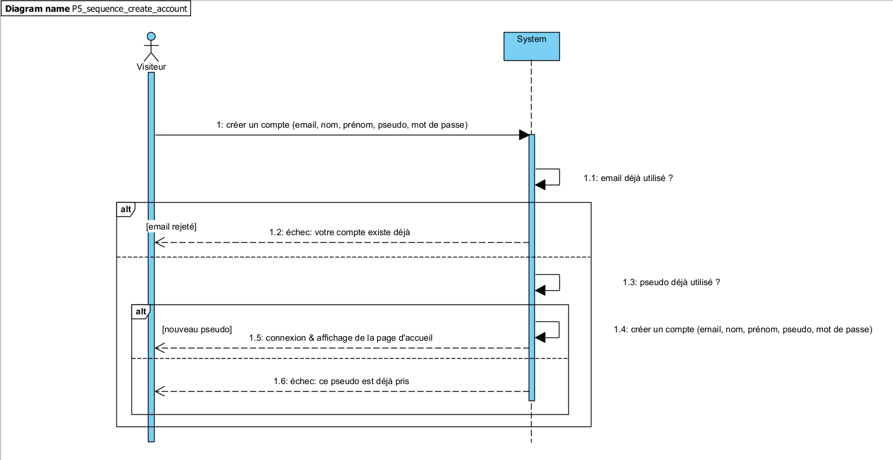
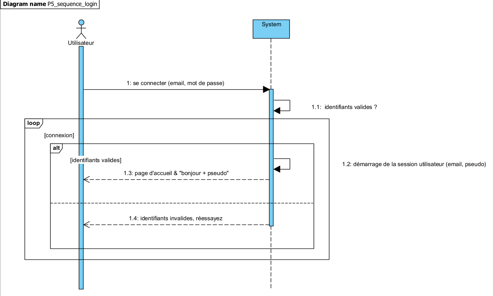

# UML diagrams

> Here you will find a series of diagrams to further delimit this project's needs.

## Class diagram

## Use case diagrams

### Overview

### Blog admin (back-office) - managing posts & comments

## Sequence diagrams

### Create an account

### Sign in

### Publish a blog post

### Edit a blog post

### Leave a comment

### Contact blog admin

## Sitemap

